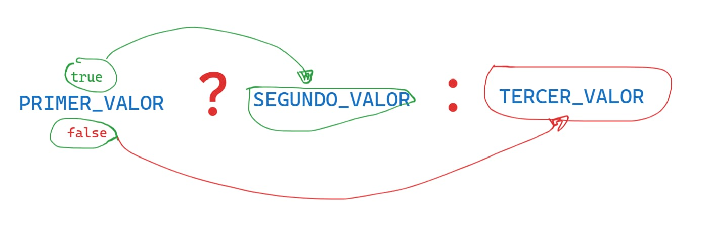

# Valores, Tipos y Operadores
## Indice
- [Valores, Tipos y Operadores](#valores-tipos-y-operadores)
  - [Indice](#indice)
  - [valores](#valores)
      - [datos primitivos](#datos-primitivos)
      - [-numeros(number)](#-numerosnumber)
      - [numeros especiales](#numeros-especiales)
      - [aritmeticas](#aritmeticas)
      - [Cadenas](#cadenas)
      - [concatenacion](#concatenacion)
      - [plantillas literales](#plantillas-literales)
      - [operadores unarios](#operadores-unarios)
      - [valores boleanos](#valores-boleanos)
      - [Operador Ternario](#Operador-Ternario)
## valores
Imaginen un mar de bits .
Una computadora moderna tiene mas de 100 mil millones de bits almacenados en su `memoria de trabajo` o `memoria principal` o `memoria volatil` o `ram`.
Ahora la memoria no volatil o memoria secundaria tiene estos bits de manera ordenada generalmente apilada como si de un estante de una biblioteca se tratara.

cuando nosotros programamos hacemos uso de`memoria de trabajo`, para trabajar de manera ordenada con los bitd que se encuentran en nuestro mar de bits, javascript ordena los bits en pequeñas partes o piezas de informacion a esto se lo conoce como`valores`cada valor tiene una funcionalidad distinta puede ser numero un textoo una funcion .

cuando hablamos de tipos de datos en javascript nos referimos a su representacion
binaria y al tipo de valor que usamos.
#### datos primitivos
son aquellos datos que ya existen no pueden ser creados, actualizados ni eliminados solo pueden ser llamados para el uso que deseamos darle.
los datos primitivos en js son:
#### -numeros(number)   
los valores de tipo numero , como es de esperar son numeros  y en javasript se escribe o se hacer el lllamado de este valor de los siguiente manera:
- numero de tipo entero
js
20
// estamos usando un patron de bits para en numero 20 que existira  dentro de la memoria  de trabajo

- numero de punto flotante decimal fraccion 
```js
2.7
0.
.0
```
>[!TIP]
>cuando javasript hace trabajo de memoria (cuando crea un patron de bit para alamacenar) todos numeros son almacena como decimal positivo.
- numero notacion cientifica
```js
2.338e8
// 2.998 * 10^8
```

>[!WARNING]
>cuando js realiza operaciones con numeros enteros el resul,tado siempre sera exacto, cuando realice operaciones con numeros decimales el resultado perdera precision pór que solo tiene 64 bit para almacenar el numero esto suele ocurrir a cuyos decimales sean infinitos como el caso el numero PI ##es nuestra responsabilidad como programadoreshacer el uso de los decimales con aproximadamente para evitar errores##.
>[!TIP]
> cuando javascript hace trabajo de memoria (cuando crea un patron de bit para almacenar) todos los numeros son almacenados como decimal positivo.
```js
// dato numerico de tipo entero
// entero positivo
23
// entero negativo
-23
//decimal positivo
0.
//decimal negativo
-3,6
```

#### numeros especiales
en js existen tres valores de tipo numero que se consideran un dato primitivo numerico de tip0o especial.
```js
Infinity
- Infinity
NaN // not a number
// no es un numero
// cuando el resultado de una operacion es matematicamente imposible. te muestra nann infinity
```
>cuando javascript hace trabajo de memoria(cuando crea un patron de bit para alamcenar) todos numero se almacena como decimal positivo.
- numeros especiales 
En javascript existen tres valores de tipo numero que se consideran un dato primitivo numerico de tipo especial
```js
infinity
- infinity // negativo
NaN // not a number
// cuando el resultado de una operacion es matematicamente imposible.
```
#### aritmeticas
la principal operacion que se puede hacer co numeros es la aritmetica . para eso tenemos los operadores aritmeticos como:

- suma (+)
- resta(-)
- multiplicacion(*)
- division(/)
- potencia(*) 
- modulo(%) 

* podemos agrupar operaciones con parentesis () las operaciones que esten dentro del parentesis se ejecutaran primero*
consulta el archivo de operadores [aqui](./operadores.js). ve los ejercicios [aqui](./ejercicios.js)
#### Cadenas
El siguiente tipo de dato primitivo es la cadena - string.
¿para que se usan las cadenas en javascript?
- para representar texto 
una cadena se escribe encerrando su contenido entre comillas:
```js
// cadenas con contenido
"soy un texto" // comillaws dobles
'tambien soy un texto' // comillas simples
`yo tambien soy` // acento grave es una incorporacion de emnascript 6 

//cadena vacia
""

*Problema* - como representamos un texto entre comillas 
para hacer el uso de comillas dentro del contenido de una cadena podemos seguir las siguientes recomendaciones:
js
// si nuestro texto tiene que estar entre comillas simples
"'este texto se muestra entre comillas simples'"
// si nuestro texto tiene que estar entre comillas dobles
'"este texto se muestra entre comillas dobles"'
// si nuestro texto tendra tanto comillas dobles como simples
`'esta en comillas simples',"esta en comillas dobles"`

otra manera de hacer lo antes mensionado es haciendo uso de la barra ivertida \ tambien conocida como caracter de escape.

hacer uso de este caracter indica que el caracter posterior tendra un significado especial.
js
"de este texto solo esta \"palabra\" estara en comillas"

*problema* - deseamos agregar un salto de linea en nuestro texto.
js
// solucionamos este problema haciendo uso de los acentos graves
'primera linea 
segunda linea'

antes de la incorparacion de enmascript 6 en el uso de acentos graves () se utilizaba el caracter de escape `\
js
"esta es mi primera linea \n
y esta es la segunda linea 
* podemos agrupar operaciones con parentesis ()las operaciones que este entre los parentesis se ejecutaran primero consulta el archivo de operadores aqui para ver los ejercicios aqui
#### cadenas
el siguiente tipo de dato primitivo es la cadena-string.
¿para que se usa las cadenas de javacript?
-para repreentar texto
se escribe encerrado su contenido entre comillas:
```js
//cadenas con contenido
"
**Problema** -como respresentamos u texto entre comillas para hacer el uso de comillas dentro del contenido de una cadena podemos seguir las siguientes recomendaciones:
```js
//si nuestro texto tiene que estar entre comillas simples
"este texto se mjuestra entre comillas simples"
//si nuestro texto tiene que estar entre comillas dobles"
""este texto se mjuestra entre comillas simples""
//si nuestro texto tendra tanto comillas dobles como simples
esta en comillas simples , "esta en comillas dobles"`
```
otra manera de hacer los antes mencionados es haciendo uso de la barra invertida `\` tambien conocida como `caracter de escape`.
hacer uso de este caracter indica que el caracter posterior tendra un significado especial.
```
" de este texto solo esta \"palabra\" estara en comillas "
**Problema** - deseamos agtreagar un salto de linea en nuestro texto.
//solucionamos este problema haciendo uso de los acentos graves
'primera linea 
segunda linea'

antes de la incorparacion de enmascript 6 en el uso de acentos graves () se utilizaba el caracter de escape `\
```js
"esta es mi primera linea \n
y esta es la segunda linea 
```
*problema* - deseo tabular un texto

```js
este texto no esta tabulado
este texto si esta tabulado
```

ahora tabularemos haciendo uso del caracter de escape
```js
"sin tabular \t y tabulado"
```

#### concatenacion
el unico operador aritmetico que puede ser usadoi por cadenas es el operador de suma (+) puede ser usado entre dos o mas cadenas y pasa a ser llamado operador de concatenacion, lo que realiza es unir cadenas en una sola.
```js
"hola"+" "+"mundo"
```
#### plantillas literales
las plantillas literales mencionadas anteriormente con el nombre de acento graves son usadas para mostrar texto literal, tambien nos permite ejecutar codigo javaScript dentro de una plantillas literal el codigo o el resultado de este codigo sera transformado en un dato de tipo texto y se incluira en la posicion en q se encuentre.
para hacer uso de esta funcionalidad debemos usar, la siguiente expresion `${}`
```js
//creando plantilla literal - template literals
```
//usando dentro de una plantilla literal
```js
la suma de 1+1 es $[1+1]
```
>[!TIP]
> se dise literal por q con el formato que codificamos sera mostrado de esa misma forma en la consola
#### operadores unarios
no todos los operadores son simbolos, algunos se escriben como palabras.
un ejemplo es el operador `typeof`, es operador produce un valor de cadena que indica el tipo del valor que le proporcionamos.

`operadores binarios` se les conoce por que operan sobre dos valores `2*5`
`operador unario` por que  solo trabaja con un valor.
```js
//para poder ver su funcionalidad o el valor que genera siempre debmos mostrarlo en un console 
console.log(typeof 5)
```
#### valores boleanos
este tipo de dato primitivo es util cuando tenemos un valor que distinga solo entre dos posibilidades, como `si` y `no` o `encendido` y `apagado`
para este proposito, javaScript tiene un tipo de dato `booleano`, que tiene solo dos valores `true` y `false`.
**que fromas de producir valores booleanos tenemos?**
1. **Usando operadores de comparacion**
  los operadores de comparacion son los siguientes 
  -Mayor que(>).
  -Mayor que(<).
  -Mayor o igual que(>=).
  -Mayor o igual que(<=).
  -Igual a(==).
  -Extrictamente igual (===).
  -No es igual a (!=).
2. **Usando los Operadores Logicos**
 javaScript soporta tres operadores logicos 
 - and (y) respresentacion en javaScript `&&`,
 - or (o) represntacion en javaScript `||`,
 - not (no) representacion en js `!`,
**Observacion**este es un operador unario que su funcion es invertir el valor que tiene a su derecha`!true` produce `false`
>[!TIP]
**AND `&&` `??`** - Si tenemos dos valores verdaderos devolvera el segundo valor verdadero, si tenemos valor falso y uno verdadero devolvera el valor falso.

>[!TIP]
**OR `||`** - si tenemos dos valores verdaeros devolvera el primer valor verdadero, si tenemos un valor verdadero y uno falso devolvera el valor verdader.

3. **usando el operador relacional**
este operador compara sus valores y retorna un booleano como resultado.
lo que evalua este operador es si una propiedad espesifica se encuentra en un objeto.
evalua si el primer valor que se encuentra asu izquierda existe o forma parte del segundo valor que se encuentra derecha.
```js
"a" in ["a","e","i","o","u"]
```
**TAREA**
- Averiguar: por que muestra falso.

console.log(["hola"] in ["hola", "mundo"])
En JavaScript, la expresión "a" in ["a", "e"] da como resultado false porque el operador in se utiliza para verificar si una propiedad existe en un objeto, o un índice en un array, no el valor en sí.
En este caso, ["a", "e"] es un array, y "a" no es un índice válido de ese array. Los índices válidos para este array son 0 y 1.
Para verificar si el valor "a" está presente en el array, deberías usar el método includes()*/
#### Operador Ternario
este operador trabaja con tres valores.
el primer valor es el que determinara si se muestra el reto de valores.
eso quiere decir que si el primer valor es verdadero mostrara el segundo valor mientras que si es falso mostrara el tercer valor.
 